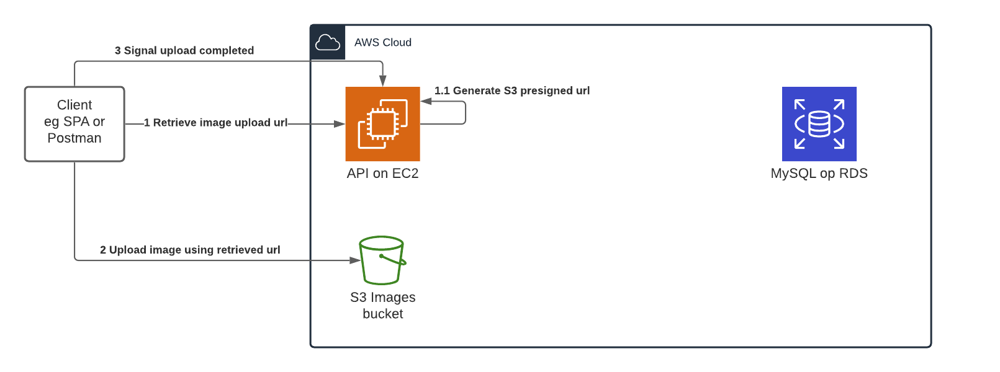

## Analyse en architectuur
# Samenvatting(bare minimum)

Er word door onze klant gevraagd om een platform te ontwikkelen waarbij gebruikers verschillende afbeeldingen kunnen uploaden en deze worden omgezet naar een GIF (Graphics Interchange Format) bestand. Dit bestand wordt getoond en kan ook door de gebruiker worden opgeslagen op zijn eigen computer (downloaden).  Gebruikers kunnen het GIF bestand nog altijd opvragen via een URL dat 1 dag geldig is, hierna kan het GIF bestand niet meer opgevraagd worden.

# Technische aspecten(bare minimum)

Om dit platform te realiseren zullen we gebruik maken van een API om zowel de bestanden te uploaden als deze om te vormen tot een GIF. Na het omvormen van de afbeeldingen tot een GIF zal dit bestand tijdelijk worden opgeslagen in een databank. De originele afbeeldingen opslaan lijkt een overbodige functie.
Nadat de geldigheidsperiode van 1 dag is verstreken worden alle gerelateerde bestanden (bestanden die dus ouder zijn dan 1 dag) verwijdert worden.
Om er voor te zorgen dat enkel geauthentiseerde gebruikers toegang hebben tot het maken van GIF bestanden zal er ook een login voorzien worden.

# Architectuur

# Verantwoording keuzes
**EC2**: Elastic Compute Cloud zal gebruikt worden voor de virtuele server. Deze service van Amazon heeft als voordeel dat de gebruikte middelen zeer snel kunnen worden aangepast. Hierdoor zal er altijd genoeg opslag en rekenkracht zijn maar nooit te veel. Ook een beschikbaarheidsgraad van 99.99% is een troef om het platform altijd online te houden.

**Cognito**: Om de identiteit van gebruikers te confirmeren zullen we gebruik maken van Amazon Cognito. Deze service zorgt voor een simpele implementatie van authenticatie d.m.v. veel gebruikte sociale media platformen zoals Google of Meta.  

**RDS**: Amazon RDS wordt gebruikt om onze relationele databank te beheren. Deze service heeft een zeer lage kost die zich aanpast aan gebruikte opslag. Deze opslag wordt ook automatisch opgeschaald. Het is veilig vanwege de mogelijkheid om het binnen onze eigen virtuele server te draaien en dus enkel hierbinnen deze kunnen bereiken.

**S3**: Een S3 (Simple Storage Service) bucket zal gebruikt worden om de GIF bestanden te uploaden naar de database
